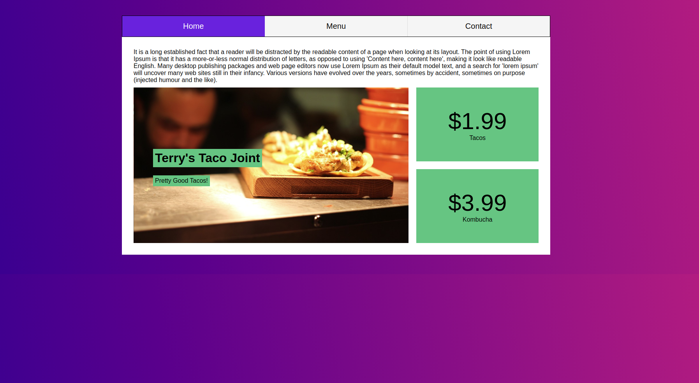
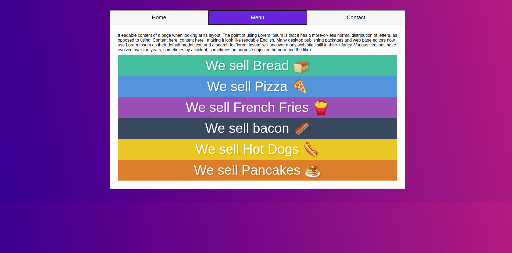
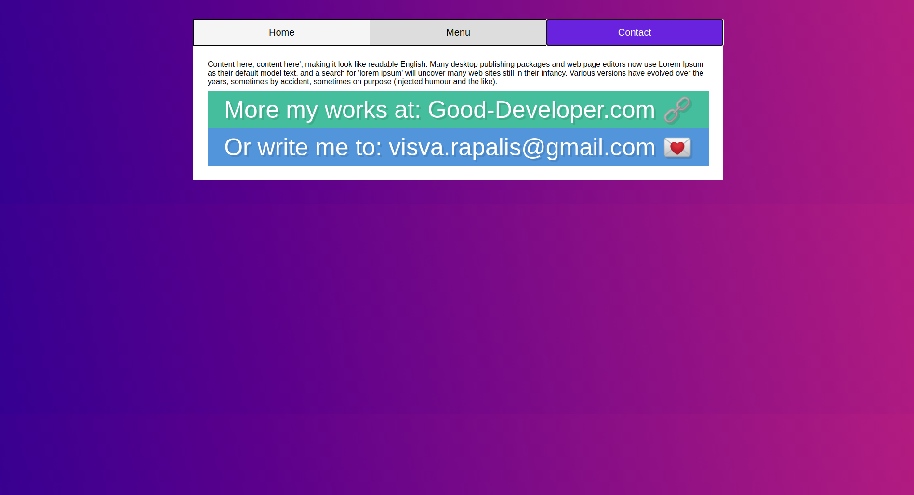

# RestaurantPage
Microverse project - Restaurant page

## Project features

- All HTML code is written in JavaScript
- Lots of DOM manipulation examples, selecting, creating, updating values and attributes.

## Live Demo Website

Click the following https://bit.ly/3kJ4s3p to see a live version of the site.


<br>
<br>
<br>

## Built With
- HTML
- CSS
- JavaScript

#### To get this project on your local machine, follow these steps:

1. Run this command `git clone https://github.com/visva-dev/RestaurantPage.git` in the desired folder to clone the repository on to your local machine.
After cloning the project, you should move into the directory where the project is stored, for example `cd RestaurantPage`.

3. Then run the following command install the necessary dependencies

```bash
    npm install
```
- Run `npm run watch` to have the necessary changes applied if you want to change anything in the codebase.
- To open run the 'index.html' with 'Live Server'.

## Authors

👤 **Visvaldas Rapalis**

- Github: [@visva-dev](https://github.com/visva-dev)
- Twitter: [@Visva_Dev](https://twitter.com/Visva_Dev)
- Linkedin: [@Visvaldas-Rapalis](https://www.linkedin.com/in/visvaldas-rapalis/)
- Website: [good-developer.com](https://good-developer.com)

## Show your support

Give an ⭐️ if you like this project!

## Acknowledgments

- This project was originally taken from [The Odin project](https://www.theodinproject.com/courses/javascript/lessons/restaurant-page).
- The project was inspired by the [Microverse](https://www.microverse.org/) program.

## 📝 License

This project is [MIT](lic.url) licensed.

Design idea by [Nelson Sakwa on Behance](https://www.behance.net/sakwadesignstudio)